# Enhanced Stock Alert System - Flowchart Breakdown

## Overview
This flowchart breaks down how the Enhanced Stock Predictor works, from data collection to trading signals.


## Technical Indicators Breakdown


## Sentiment Analysis Flow


## Prediction Algorithm Breakdown

```mermaid
flowchart TD
    A[Historical Price Data] --> B[Calculate Recent Trends]
    A --> C[Calculate Momentum]
    A --> D[Calculate Volatility]
    A --> E[Calculate RSI Factor]
    A --> F[Get Sentiment Data]
    
    B --> B1[MA5 vs MA20 Comparison]
    B1 --> B2["Trend Factor = MA5-MA20/MA20 * 0.1"]
    
    C --> C1[Daily Returns Calculation]
    C1 --> C2[Average Daily Return]
    C2 --> C3["Momentum Factor = Avg Return * 2"]
    
    D --> D1[Standard Deviation of Returns]
    D1 --> D2["Volatility Factor = SD * 0.05"]
    
    E --> E1[Gains vs Losses Analysis]
    E1 --> E2["RSI Factor = Normalized RSI * 0.02"]
    
    F --> F1[Reddit Sentiment Analysis]
    F --> F2[News Sentiment Analysis]
    F1 --> F3["Reddit Impact = Polarity * 0.05"]
    F2 --> F4["News Impact = Polarity * 0.03"]
    
    B2 --> G[Combine All Factors]
    C3 --> G
    D2 --> G
    E2 --> G
    F3 --> G
    F4 --> G
    
    G --> H[Apply Conservative Bounds ±2%]
    H --> I[Additional Dampening if >1%]
    I --> J[Final Predicted Price]
    
    classDef input fill:#e1f5fe
    classDef calculation fill:#f3e5f5
    classDef factor fill:#e8f5e8
    classDef sentiment fill:#fce4ec
    classDef result fill:#fff3e0
    
    class A input
    class B,C,D,E calculation
    class F sentiment
    class B2,C3,D2,E2 factor
    class F3,F4 sentiment
    class G,H,I,J result
```



## Trading Signal Logic


## Configuration Parameters


## Impact Breakdown Analysis

### **Prediction Factor Weights**

| Factor | Impact Level | Weight | Max Impact | Description |
|--------|-------------|---------|------------|-------------|
| **Moving Averages** | 🔴 **HIGH** | ~35% | ±2% | `trend_factor = ((ma_5 - ma_20) / ma_20) * 0.1` |
| **Momentum** | 🔴 **HIGH** | ~35% | ±2% | `momentum_factor = avg_daily_return * 2` |
| **Reddit Sentiment** | 🟡 **MEDIUM** | ~15% | ±5% | `reddit_impact = polarity * 0.05` |
| **News Sentiment** | 🟡 **MEDIUM** | ~10% | ±3% | `news_impact = polarity * 0.03` |
| **Volatility** | 🟢 **LOW** | ~3% | ±1% | `volatility_factor = volatility * 0.05` |
| **RSI** | 🟢 **LOW** | ~2% | ±0.5% | `rsi_adjustment = (rsi_factor - 0.5) * 0.02` |

### **Sentiment Impact Details**

#### **Reddit Sentiment (15% weight)**
- **Source**: r/stocks, r/investing
- **Calculation**: `reddit_impact = avg_polarity * 0.05`
- **Max Impact**: ±5% price movement
- **Processing**: 70% title weight + 30% body weight
- **Filtering**: Only posts mentioning ticker symbol

#### **News Sentiment (10% weight)**
- **Source**: Yahoo Finance news articles
- **Calculation**: `news_impact = avg_polarity * 0.03`
- **Max Impact**: ±3% price movement
- **Processing**: Title sentiment analysis only
- **Limit**: 50 articles per analysis

### **Technical vs Sentiment Impact**


### **Combined Prediction Formula**

```python
prediction_change = (
    trend_factor +           # Moving averages (35% weight)
    momentum_factor +        # Daily returns (35% weight)  
    reddit_impact +          # Reddit sentiment (15% weight)
    news_impact +            # News sentiment (10% weight)
    volatility_factor +      # Price volatility (3% weight)
    rsi_adjustment          # RSI factor (2% weight)
)

# Apply conservative bounds
prediction_change = max(-0.02, min(0.02, prediction_change))
```

## Key Features Summary

- **Multi-Source Data**: Combines stock prices, Reddit sentiment, news sentiment, and market data
- **Technical Analysis**: Calculates 15+ technical indicators including RSI, MACD, Bollinger Bands
- **Sentiment Integration**: 25% total weight for sentiment analysis (15% Reddit + 10% News)
- **Conservative Predictions**: Uses dampened factors and bounds to avoid extreme predictions
- **Configurable**: All parameters can be adjusted via config.json
- **Robust Error Handling**: Multiple fallback methods for data collection
- **Comprehensive Alerts**: Includes technical analysis, sentiment analysis, and market context
- **Real-time Capable**: Can run continuously or on-demand
- **Slack Integration**: Sends alerts to Slack channels
- **Logging**: Comprehensive logging for debugging and monitoring 