# Enhanced Stock Alert System - Flowchart Breakdown

## Overview
This flowchart breaks down how the Enhanced Stock Predictor works, from data collection to trading signals, including the new ensemble prediction methods, intraday data integration, and **config-driven architecture** that inherits all weights and metrics from `config.json`.

```mermaid
flowchart TD
    A[Start: Enhanced Stock Predictor] --> B[Load Configuration from config.json]
    B --> C[Initialize Components with Config Values]
    C --> D[Setup Logging]
    D --> E[Initialize Reddit Client]
    E --> F[Initialize Currency Settings]
    
    %% Main Analysis Flow
    F --> G[Run Daily Analysis]
    G --> H[Get Current Price with Enhanced Methods]
    G --> I[Get Historical Data]
    G --> J[Get Intraday Data with Config Settings]
    G --> K[Get Real-time Sentiment with Config Filters]
    G --> L[Get Market Microstructure with Config Features]
    
    %% Enhanced Price Fetching
    H --> H1[Method 1: Stock Info (Most Reliable)]
    H --> H2[Method 2: Fast Info]
    H --> H3[Method 3: Recent Daily Data]
    H --> H4[Method 4: Intraday Data if Market Open]
    H --> H5[Method 5: Date Range Fallback]
    H1 --> H6[Return Current Price with Currency Formatting]
    H2 --> H6
    H3 --> H6
    H4 --> H6
    H5 --> H6
    
    %% Data Collection Subflows
    I --> I1[Download Daily Stock Data]
    I1 --> I2[Add Technical Indicators]
    I2 --> I3[Calculate Moving Averages]
    I2 --> I4[Calculate RSI]
    I2 --> I5[Calculate MACD]
    I2 --> I6[Calculate Bollinger Bands]
    I2 --> I7[Calculate Volume Metrics]
    
    J --> J1[Download Intraday Data with Config Interval]
    J1 --> J2[Add Intraday Indicators]
    J2 --> J3[Intraday Moving Averages]
    J2 --> J4[Intraday RSI]
    J2 --> J5[Volume Analysis]
    J2 --> J6[Time-based Features]
    
    K --> K1[News Sentiment with Config Hours]
    K --> K2[Social Media Sentiment with Config Hours]
    K --> K3[Earnings Calendar Impact]
    K --> K4[Analyst Rating Changes]
    K --> K5[Options Flow Sentiment]
    
    L --> L1[Spread Analysis with Config Toggle]
    L --> L2[Order Flow Indicators with Config Toggle]
    L --> L3[Market Efficiency with Config Toggle]
    L --> L4[Time-based Adjustments with Config Toggle]
    
    %% Enhanced Prediction Flow with Config Weights
    H6 --> M[Enhanced Prediction Engine with Config Weights]
    I7 --> M
    J6 --> M
    K5 --> M
    L4 --> M
    
    M --> M1[Ensemble Prediction Models with Config Weights]
    M1 --> M2[Technical Analysis Model - Config Weight]
    M1 --> M3[Sentiment-Based Model - Config Weight]
    M1 --> M4[Microstructure Model - Config Weight]
    M1 --> M5[Mean Reversion Model - Config Weight]
    
    M2 --> M6[Intraday Momentum]
    M2 --> M7[Intraday RSI]
    M2 --> M8[Volume Trends]
    M2 --> M9[Volatility Analysis]
    
    M3 --> M10[News Sentiment with Config Weight]
    M3 --> M11[Social Media Sentiment with Config Weight]
    M3 --> M12[Earnings Impact with Config Weight]
    M3 --> M13[Analyst Changes with Config Weight]
    
    M4 --> M14[Spread Impact with Config Toggle]
    M4 --> M15[Volume Impact with Config Toggle]
    M4 --> M16[Market Efficiency with Config Toggle]
    M4 --> M17[Time Adjustments with Config Toggle]
    
    M5 --> M18[MA5 Reversion]
    M5 --> M19[MA10 Reversion]
    M5 --> M20[MA20 Reversion]
    
    M6 --> N[Config-Driven Weighted Ensemble]
    M7 --> N
    M8 --> N
    M9 --> N
    M10 --> N
    M11 --> N
    M12 --> N
    M13 --> N
    M14 --> N
    M15 --> N
    M16 --> N
    M17 --> N
    M18 --> N
    M19 --> N
    M20 --> N
    
    N --> N1[Config-Driven Confidence Adjustment]
    N1 --> N2[Final Predicted Price with Config Bounds]
    
    %% Trading Signal Generation
    H6 --> O[Generate Trading Signal with Config Thresholds]
    N2 --> O
    
    O --> O1[Calculate Price Change %]
    O1 --> O2{Price Change > Config Buy Threshold?}
    O2 -->|Yes| O3[BUY Signal]
    O2 -->|No| O4{Price Change < Config Sell Threshold?}
    O4 -->|Yes| O5[SELL Signal]
    O4 -->|No| O6[HOLD Signal]
    
    O3 --> O7[Calculate Confidence]
    O5 --> O7
    O6 --> O7
    
    %% Alert Generation
    O7 --> P[Send Enhanced Alert with Currency Formatting]
    P --> P1[Get Market Analysis]
    P --> P2[Get Sentiment Analysis]
    P --> P3[Get Microstructure Analysis]
    P --> P4[Create Alert Message with Currency Display]
    
    P1 --> P5[Technical Indicators Summary]
    P2 --> P6[Sentiment Summary]
    P3 --> P7[Microstructure Summary]
    P4 --> P8[Format Complete Alert with Currency]
    
    P5 --> P8
    P6 --> P8
    P7 --> P8
    P8 --> P9[Save to File]
    P8 --> P10[Send to Slack]
    P8 --> P11[Print to Console]
    
    %% Styling
    classDef startEnd fill:#000,stroke:#4FC3F7,color:#fff,stroke-width:2px
    classDef dataCollection fill:#000,stroke:#AB47BC,color:#fff,stroke-width:2px
    classDef calculation fill:#000,stroke:#66BB6A,color:#fff,stroke-width:2px
    classDef decision fill:#000,stroke:#FFB74D,color:#fff,stroke-width:2px
    classDef output fill:#000,stroke:#F06292,color:#fff,stroke-width:2px
    classDef ensemble fill:#000,stroke:#FFD54F,color:#fff,stroke-width:2px
    classDef config fill:#000,stroke:#9C27B0,color:#fff,stroke-width:2px
    
    class A startEnd
    class B,C,D,E,F config
    class G,H,I,J,K,L dataCollection
    class M,M1,M2,M3,M4,M5,M6,M7,M8,M9,M10,M11,M12,M13,M14,M15,M16,M17,M18,M19,M20 ensemble
    class N,N1,N2 calculation
    class O,O1,O2,O4,O7 decision
    class P,P1,P2,P3,P4,P5,P6,P7,P8,P9,P10,P11 output
```

## Enhanced Technical Indicators Breakdown


## Enhanced Sentiment Analysis Flow with Config Controls


## Config-Driven Ensemble Prediction Algorithm Breakdown


## Machine Learning Ensemble Architecture

```mermaid
flowchart TD
    A[Feature Engineering] --> B[Data Preparation]
    B --> C[Model Training]
    
    C --> D[Random Forest]
    C --> E[XGBoost]
    C --> F[Gradient Boosting]
    C --> G[Support Vector Regression]
    C --> H[Linear Regression]
    
    D --> I[RF Predictions]
    E --> J[XGB Predictions]
    F --> K[GB Predictions]
    G --> L[SVR Predictions]
    H --> M[LR Predictions]
    
    I --> N[Performance Evaluation]
    J --> N
    K --> N
    L --> N
    M --> N
    
    N --> O[Calculate R² Scores]
    O --> P[Weight by Performance]
    P --> Q[Ensemble Prediction]
    
    classDef data fill:#000,stroke:#64B5F6,color:#fff,stroke-width:2px
    classDef model fill:#000,stroke:#AB47BC,color:#fff,stroke-width:2px
    classDef prediction fill:#000,stroke:#66BB6A,color:#fff,stroke-width:2px
    classDef ensemble fill:#000,stroke:#FFD54F,color:#fff,stroke-width:2px
    
    class A,B data
    class C,D,E,F,G,H model
    class I,J,K,L,M prediction
    class N,O,P,Q ensemble
```



## Enhanced Configuration Parameters with Config Inheritance


## Enhanced Impact Breakdown Analysis with Config-Driven Weights

### **Config-Driven Ensemble Model Weights & Impact**

| Model | Config Weight | Max Impact | Key Features | Description |
|-------|--------------|------------|--------------|-------------|
| **Technical Analysis** | 🔴 **Config: 50%** | ±2% | Intraday momentum, RSI, volume trends | `intraday_momentum * 0.4 + rsi_factor * 0.3 + volume_factor * 0.2 + volatility_factor * 0.1` |
| **Sentiment-Based** | 🟡 **Config: 20%** | ±1% | News, social media, earnings, analyst ratings | `news_sentiment * 0.3 + social_sentiment * 0.25 + earnings_impact * 0.2 + analyst_impact * 0.15 + options_sentiment * 0.1` |
| **Microstructure** | 🟡 **Config: 15%** | ±1.5% | Spread analysis, order flow, market efficiency | `spread_impact * 0.1 + volume_impact * 0.05 + efficiency_impact * 0.02` |
| **Mean Reversion** | 🟢 **Config: 15%** | ±1% | MA5, MA10, MA20 reversion | `weighted_reversion * 0.3` |

### **Config-Driven Intraday Data Impact**

#### **Configurable Interval Analysis**
- **Data Granularity**: Configurable intervals (5m, 15m, 30m, 1h)
- **Pattern Recognition**: Intraday momentum, volume spikes, price gaps
- **Time-based Features**: Market hours, end-of-day effects, lunch hour patterns
- **Technical Indicators**: Shorter RSI (7-period), intraday moving averages

#### **Configurable Market Microstructure Features**
- **Spread Proxies**: High-low range analysis for bid-ask spread estimation (Config Toggle)
- **Order Flow**: Volume trends, price impact of volume changes (Config Toggle)
- **Market Efficiency**: Price change volatility, mean reversion tendencies (Config Toggle)
- **Time Adjustments**: End-of-day effects, market hour adjustments (Config Toggle)

### **Config-Driven Real-time Sentiment Sources**


### **Enhanced Config-Driven Prediction Formula**

```python
# Config-Driven Ensemble Prediction
ensemble_weights = config.get('ensemble_weights', {
    'technical_analysis': 0.5,
    'sentiment_based': 0.2,
    'microstructure': 0.15,
    'mean_reversion': 0.15
})

ensemble_prediction = (
    technical_prediction * ensemble_weights['technical_analysis'] +
    sentiment_prediction * ensemble_weights['sentiment_based'] +
    microstructure_prediction * ensemble_weights['microstructure'] +
    mean_reversion_prediction * ensemble_weights['mean_reversion']
)

# Config-Driven Technical Analysis Components
technical_prediction = (
    intraday_momentum * 0.4 +
    rsi_factor * 0.3 +
    volume_factor * 0.2 +
    volatility_factor * 0.1
)

# Config-Driven Sentiment Components
real_time_sentiment_config = config.get('real_time_sentiment', {})
sentiment_weights = {}
if real_time_sentiment_config.get('enable_news_sentiment', True):
    sentiment_weights['news_sentiment'] = 0.3
if real_time_sentiment_config.get('enable_social_sentiment', True):
    sentiment_weights['social_sentiment'] = 0.25
# ... etc

# Config-Driven Confidence Adjustment
prediction_bounds = config.get('prediction_bounds', {})
confidence_dampening = prediction_bounds.get('confidence_dampening', 0.5)
if prediction_std > price_std:
    confidence_factor = price_std / prediction_std
    final_prediction = current_price + (ensemble_prediction - current_price) * confidence_factor
```

## Key Enhanced Features Summary with Config Inheritance

### **Data Sources with Config Control**
- **Intraday Data**: Configurable intervals for granular analysis
- **Market Microstructure**: Configurable feature toggles for spread, volume, efficiency analysis
- **Real-time Sentiment**: Configurable hours and source toggles for sentiment analysis
- **Technical Indicators**: Enhanced with intraday-specific calculations

### **Config-Driven Prediction Methods**
- **Ensemble Approach**: 4 specialized models with configurable weights
- **Machine Learning**: Random Forest, XGBoost, SVR, Gradient Boosting
- **Config-Driven Confidence Adjustment**: Reduces prediction magnitude when models disagree
- **Fallback Mechanisms**: Multiple prediction methods for reliability

### **Advanced Configurable Features**
- **Time-based Adjustments**: Market hours, end-of-day effects
- **Volume Analysis**: Intraday volume trends, price impact
- **Sentiment Integration**: Multi-source real-time sentiment analysis with config toggles
- **Risk Management**: Configurable bounds, confidence scoring

### **Configuration-Driven Architecture**
- **Flexible Weights**: Adjustable ensemble model weights via config
- **Feature Toggles**: Enable/disable specific analysis components via config
- **Prediction Bounds**: Configurable maximum change limits
- **Real-time Options**: Control sentiment analysis sources via config
- **Currency Handling**: Automatic currency detection and formatting

### **Performance Improvements with Config Control**
- **Higher Accuracy**: Ensemble methods reduce prediction variance
- **Better Granularity**: Configurable intraday data captures short-term patterns
- **Real-time Updates**: Configurable sentiment filtering for relevance
- **Robust Fallbacks**: Multiple prediction methods ensure reliability
- **Configurable Precision**: Adjustable bounds and thresholds

### **Enhanced Monitoring & Logging**
- **Detailed Analysis**: Comprehensive technical and sentiment breakdowns
- **Performance Tracking**: Model accuracy and configurable ensemble weights
- **Error Handling**: Graceful degradation with fallback methods
- **Alert System**: Enhanced notifications with detailed analysis and currency formatting
- **Config Validation**: Automatic validation of configuration parameters

## Recent Enhancements (Latest Updates)

### **Config Inheritance Implementation**
- ✅ **All weights and metrics now inherited from config.json**
- ✅ **No more hardcoded values in the codebase**
- ✅ **Centralized configuration management**
- ✅ **Easy tuning without code changes**

### **Enhanced Price Fetching**
- ✅ **Multiple fallback methods for reliable price data**
- ✅ **Improved currency detection and formatting**
- ✅ **Better error handling for rate limiting**
- ✅ **Clear currency indicators in output**

### **Robust Error Handling**
- ✅ **Graceful handling of Yahoo Finance rate limiting**
- ✅ **Better logging and error messages**
- ✅ **No crashes on temporary failures**
- ✅ **Comprehensive fallback mechanisms**

### **Currency Handling Improvements**
- ✅ **Automatic currency detection from stock data**
- ✅ **Clear currency formatting (e.g., "$375.50 USD")**
- ✅ **Support for multiple currencies (USD, CAD, EUR, etc.)**
- ✅ **Proper currency symbols and codes** 