# Enhanced Stock Alert System - Flowchart Breakdown

## Overview
This flowchart breaks down how the Enhanced Stock Predictor works, from data collection to trading signals, including the new ensemble prediction methods and intraday data integration.


## Enhanced Technical Indicators Breakdown


## Enhanced Sentiment Analysis Flow


## Ensemble Prediction Algorithm Breakdown


## Machine Learning Ensemble Architecture

```mermaid
flowchart TD
    A[Feature Engineering] --> B[Data Preparation]
    B --> C[Model Training]
    
    C --> D[Random Forest]
    C --> E[XGBoost]
    C --> F[Gradient Boosting]
    C --> G[Support Vector Regression]
    C --> H[Linear Regression]
    
    D --> I[RF Predictions]
    E --> J[XGB Predictions]
    F --> K[GB Predictions]
    G --> L[SVR Predictions]
    H --> M[LR Predictions]
    
    I --> N[Performance Evaluation]
    J --> N
    K --> N
    L --> N
    M --> N
    
    N --> O[Calculate R² Scores]
    O --> P[Weight by Performance]
    P --> Q[Ensemble Prediction]
    
    classDef data fill:#e1f5fe
    classDef model fill:#f3e5f5
    classDef prediction fill:#e8f5e8
    classDef ensemble fill:#fff8e1
    
    class A,B data
    class C,D,E,F,G,H model
    class I,J,K,L,M prediction
    class N,O,P,Q ensemble
```



## Enhanced Configuration Parameters


## Enhanced Impact Breakdown Analysis

### **Ensemble Model Weights & Impact**

| Model | Weight | Max Impact | Key Features | Description |
|-------|--------|------------|--------------|-------------|
| **Technical Analysis** | 🔴 **40%** | ±2% | Intraday momentum, RSI, volume trends | `intraday_momentum * 0.4 + rsi_factor * 0.3 + volume_factor * 0.2 + volatility_factor * 0.1` |
| **Sentiment-Based** | 🟡 **25%** | ±1% | News, social media, earnings, analyst ratings | `news_sentiment * 0.3 + social_sentiment * 0.25 + earnings_impact * 0.2 + analyst_impact * 0.15 + options_sentiment * 0.1` |
| **Microstructure** | 🟡 **20%** | ±1.5% | Spread analysis, order flow, market efficiency | `spread_impact * 0.1 + volume_impact * 0.05 + efficiency_impact * 0.02` |
| **Mean Reversion** | 🟢 **15%** | ±1% | MA5, MA10, MA20 reversion | `weighted_reversion * 0.3` |

### **Intraday Data Impact**

#### **5-Minute Interval Analysis**
- **Data Granularity**: 288 data points per day vs 1 daily point
- **Pattern Recognition**: Intraday momentum, volume spikes, price gaps
- **Time-based Features**: Market hours, end-of-day effects, lunch hour patterns
- **Technical Indicators**: Shorter RSI (7-period), intraday moving averages

#### **Market Microstructure Features**
- **Spread Proxies**: High-low range analysis for bid-ask spread estimation
- **Order Flow**: Volume trends, price impact of volume changes
- **Market Efficiency**: Price change volatility, mean reversion tendencies
- **Time Adjustments**: End-of-day effects, market hour adjustments

### **Real-time Sentiment Sources**


### **Enhanced Prediction Formula**

```python
# Ensemble Prediction
ensemble_prediction = (
    technical_prediction * 0.4 +
    sentiment_prediction * 0.25 +
    microstructure_prediction * 0.2 +
    mean_reversion_prediction * 0.15
)

# Technical Analysis Components
technical_prediction = (
    intraday_momentum * 0.4 +
    rsi_factor * 0.3 +
    volume_factor * 0.2 +
    volatility_factor * 0.1
)

# Sentiment Components
sentiment_prediction = (
    news_sentiment * 0.3 +
    social_sentiment * 0.25 +
    earnings_impact * 0.2 +
    analyst_impact * 0.15 +
    options_sentiment * 0.1
)

# Confidence Adjustment
if prediction_std > price_std:
    confidence_factor = price_std / prediction_std
    final_prediction = current_price + (ensemble_prediction - current_price) * confidence_factor
```

## Key Enhanced Features Summary

### **Data Sources**
- **Intraday Data**: 5-minute intervals for granular analysis
- **Market Microstructure**: Spread analysis, order flow, efficiency metrics
- **Real-time Sentiment**: 4-hour filtered news, social media, earnings impact
- **Technical Indicators**: Enhanced with intraday-specific calculations

### **Prediction Methods**
- **Ensemble Approach**: 4 specialized models with weighted combination
- **Machine Learning**: Random Forest, XGBoost, SVR, Gradient Boosting
- **Confidence Adjustment**: Reduces prediction magnitude when models disagree
- **Fallback Mechanisms**: Multiple prediction methods for reliability

### **Advanced Features**
- **Time-based Adjustments**: Market hours, end-of-day effects
- **Volume Analysis**: Intraday volume trends, price impact
- **Sentiment Integration**: Multi-source real-time sentiment analysis
- **Risk Management**: Conservative bounds, confidence scoring

### **Configuration Options**
- **Flexible Weights**: Adjustable ensemble model weights
- **Feature Toggles**: Enable/disable specific analysis components
- **Prediction Bounds**: Configurable maximum change limits
- **Real-time Options**: Control sentiment analysis sources

### **Performance Improvements**
- **Higher Accuracy**: Ensemble methods reduce prediction variance
- **Better Granularity**: Intraday data captures short-term patterns
- **Real-time Updates**: 4-hour sentiment filtering for relevance
- **Robust Fallbacks**: Multiple prediction methods ensure reliability

### **Monitoring & Logging**
- **Detailed Analysis**: Comprehensive technical and sentiment breakdowns
- **Performance Tracking**: Model accuracy and ensemble weights
- **Error Handling**: Graceful degradation with fallback methods
- **Alert System**: Enhanced notifications with detailed analysis 